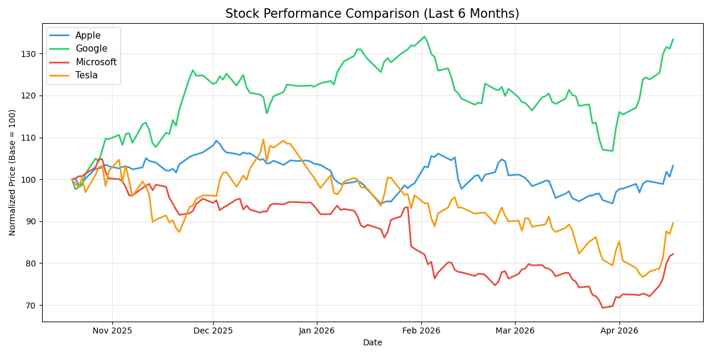
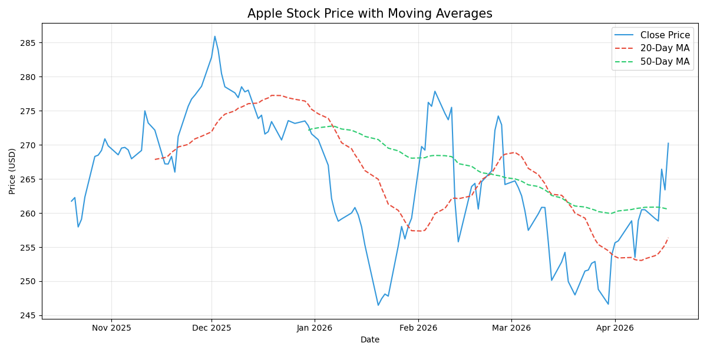
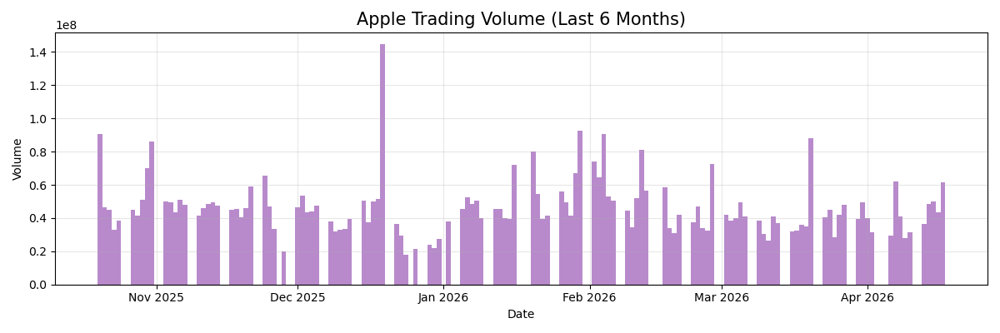

# Stock Price Visualizer 📈

Pulls live stock data from the internet and visualizes price trends,
moving averages, and trading volume.

## Tools Used
- Python, Pandas, Matplotlib, yfinance

## What I Did
- Downloaded 6 months of live data for Apple, Google, Microsoft and Tesla
- Normalized prices to 100 for fair comparison across stocks
- Plotted 20-day and 50-day moving averages for Apple
- Visualized daily trading volume

## Key Finding
Live data pulled fresh every run — results change daily.
Moving averages reveal trend direction and momentum clearly.

## Results

